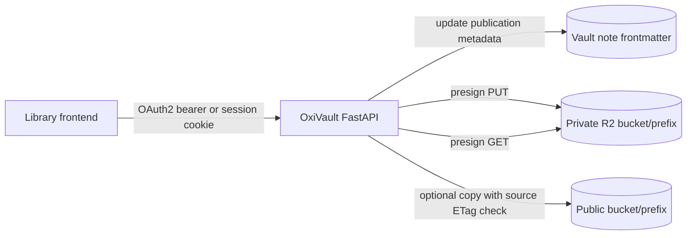

# ADR-0001: publication-helper-for-master-library

- **Status:** Proposed
- **Date:** 2026-10-04
- **Authors:** @dkapitan, Copilot

## Context and Problem Statement

master-library will use oxivault as the metadata and media storage backend for private masters and public audience playback.
ADR-0003 in the consuming repository requires authenticated API access, role separation between audience and librarians, direct browser uploads, private temporary downloads, and a publication helper that can drive metadata and optional copy-based delivery.
Which first-iteration publication flow keeps the system secure and usable while minimizing moving parts and migration risk?

## Considered Options

1. Metadata-only publication in oxivault, with copy/export handled outside the API.
2. Publication endpoint that updates note metadata and optionally performs a verified copy to a public prefix or bucket.
3. Full workflow engine with staged review states, background jobs, and asynchronous publication events.

## Decision Outcome

Chosen option: "Publication endpoint that updates note metadata and optionally performs a verified copy to a public prefix or bucket".
This option satisfies ADR-0003 requirements now, keeps publication logic server-side for consistent authorization and auditability, and avoids introducing workflow orchestration before operational needs are proven.

### Consequences

- Good, because the same endpoint enforces editor-only publication writes, centralizes metadata transitions, and supports both metadata-only and copy-based delivery patterns.
- Good, because copy operations are guarded by source ETag verification, so the public copy cannot silently drift from the reviewed master.
- Bad, because first iteration uses simple token and session auth with static configuration and no external identity provider integration.
- Bad, because publication remains synchronous, so large copy operations can increase request latency until async job handling is introduced.

## Architecture

## Rollout

1. Add OAuth2 bearer and session-cookie auth with `read` and `editor` roles, and gate all endpoints behind auth.
2. Configure CORS allow-list for trusted front-end origins.
3. Add `presign_put` and `presign_get` operations to object stores with S3-compatible implementation in `S3Store`.
4. Add publication endpoint that updates note frontmatter publication metadata and optionally copies a verified master to a public location.
5. Revisit identity provider integration, audit trails, and asynchronous publication jobs after production usage validates the need.
